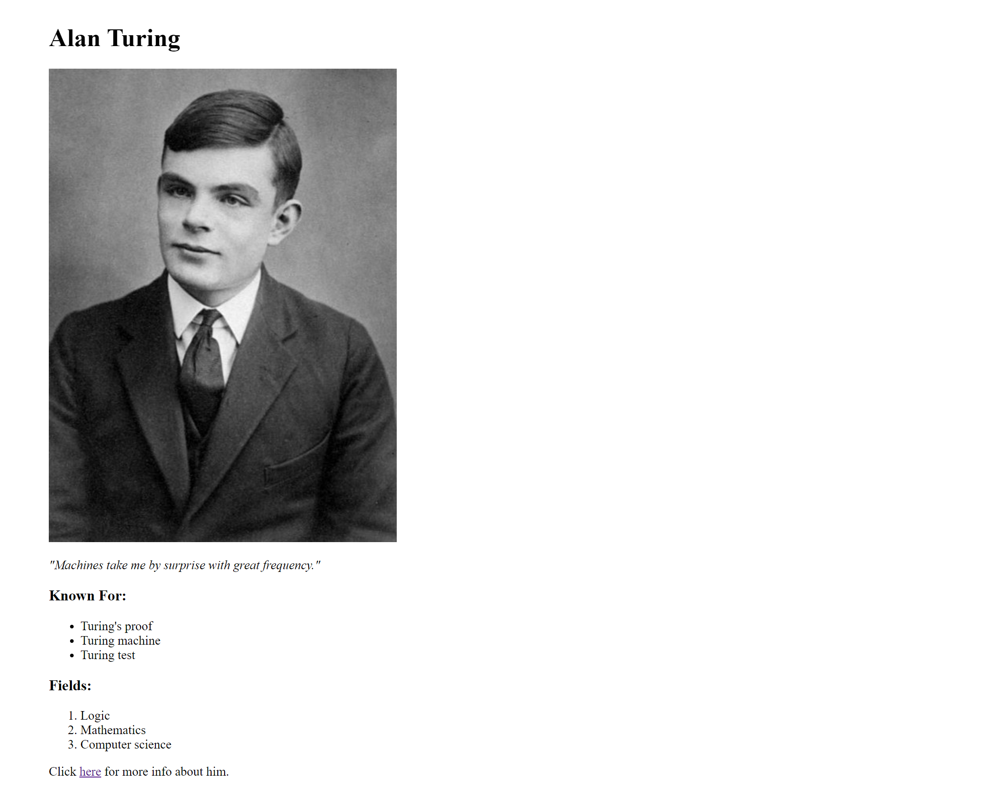

# HTML Code Challenge

1. Create a webpage that looks exactly like this picture:

    

2. Make sure to include these links for the image tag and the anchor tag.
    
    * Image link: https://upload.wikimedia.org/wikipedia/commons/thumb/a/a1/Alan_Turing_Aged_16.jpg/440px-Alan_Turing_Aged_16.jpg"
    
    * Anchor link: https://en.wikipedia.org/wiki/Alan_Turing

